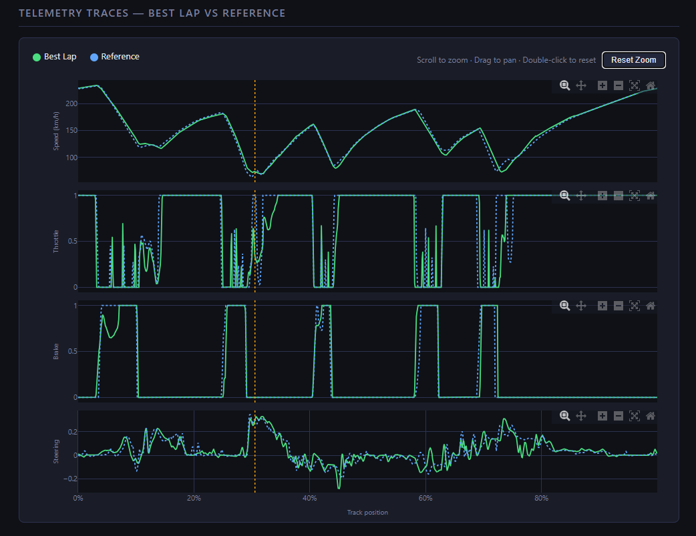
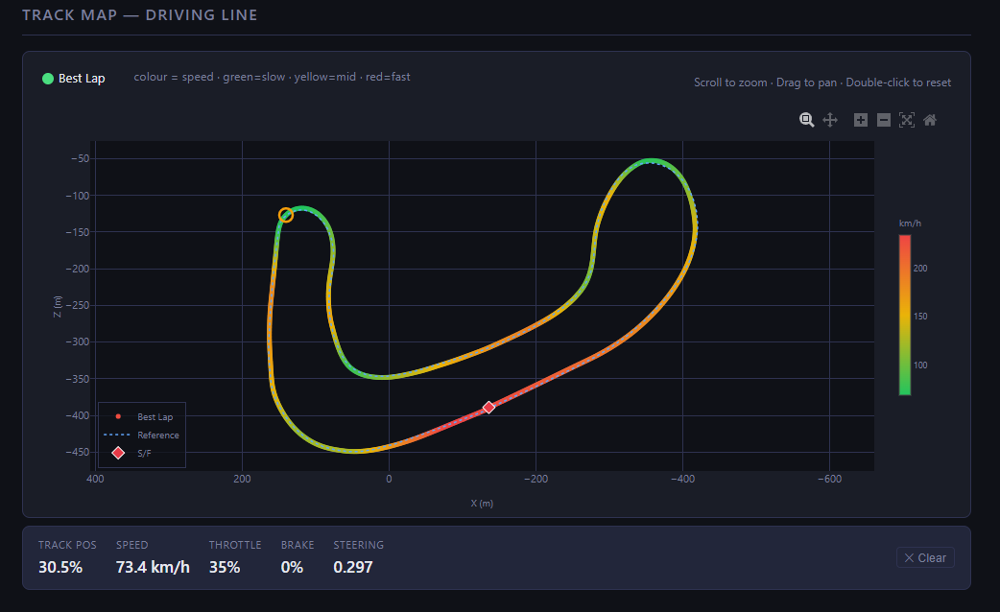
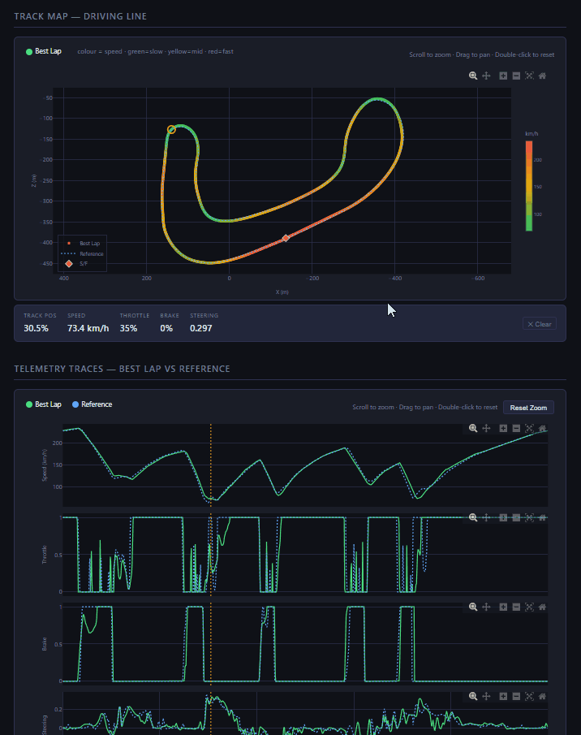
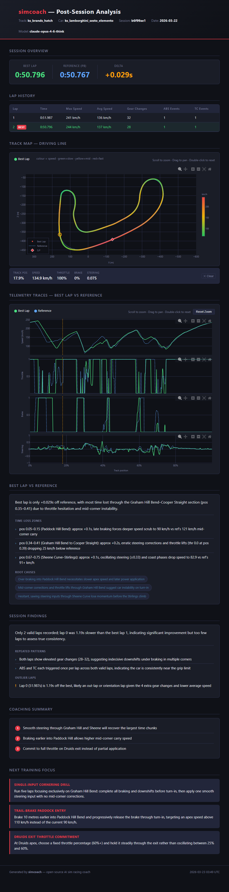
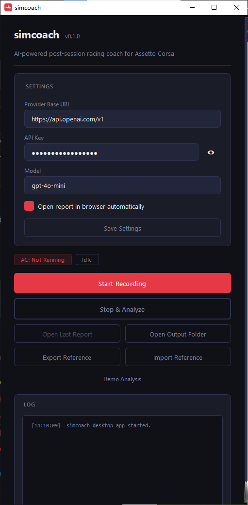

[English](#english) | [中文](#中文)

---

<a name="english"></a>

# simcoach

**AI-powered post-session racing coach for Assetto Corsa.**

simcoach records your driving telemetry, builds a structured analysis context, calls a large language model, and produces a local interactive HTML report — no hard-coded driving rules, no cloud dependency beyond your own API key.

```
Drive → Record → Analyse → Read report → Drive better
```

---

## Key Features

- **Telemetry capture** — reads Assetto Corsa shared memory at 25 Hz on Windows, auto-detects lap boundaries
- **Best lap vs reference** — compares your best lap against your stored personal best, resampled to 100 track-position points
- **Interactive telemetry charts** — speed, throttle, brake, and steering plotted on a shared x-axis with zoom/pan sync
- **Track Map** — 2D racing line reconstruction with speed-gradient colouring (green → yellow → red) and reference lap overlay
- **Linked interaction** — click any point on the track map to highlight that exact moment across all telemetry charts
- **AI coaching** — LLM analyses the telemetry and produces structured feedback: time-loss zones, technique patterns, priority improvements
- **No hard-coded rules** — the LLM decides what matters based on the actual data
- **Provider-agnostic** — works with OpenAI, OpenRouter, local Ollama, or any OpenAI-compatible endpoint
- **Desktop GUI** — PySide6 desktop application; record and analyse without touching the command line
- **Accurate lap timing** — lap times aligned with Assetto Corsa's official timer (`iLastTime`), not wall-clock estimates
- **Shareable reference laps** — export and import `.simcoachref` files to benchmark against community fast laps
- **Demo mode** — full pipeline test with synthetic data, no Assetto Corsa or API key required

---

## Screenshots

### 1. Telemetry Traces



> **Screenshot needed:** `docs/images/telemetry_traces.png`
> Capture the Telemetry Traces section in the HTML report showing:
> - Speed, throttle, brake, and steering charts stacked vertically
> - Best lap trace in green, reference lap in blue dotted
> - Zoom interaction active on at least one chart
> - Reset Zoom button visible in the toolbar

---

### 2. Track Map



> **Screenshot needed:** `docs/images/track_map.png`
> Capture the Track Map section in the HTML report showing:
> - Best lap trajectory with speed colour gradient (green = slow, yellow = mid, red = fast)
> - Reference lap as a blue dotted overlay
> - Start/finish diamond marker
> - Speed colourbar on the right side
> - Equal-axis track shape (corners look like corners, not stretched)

---

### 3. Track Map → Telemetry Interaction (Animated Demo)



> **Animation needed:** `docs/images/track_map_linked.gif`
> This animation demonstrates the interactive linking between the Track Map and telemetry charts.
> Clicking a point on the racing line highlights the corresponding position across all telemetry traces.
> The recording should show:
> - Clicking a point on the Track Map — amber open-circle marker appears at the selected position
> - Yellow dashed vertical line updating across all four telemetry charts simultaneously
> - The selection info panel below the map showing Track Pos %, Speed (km/h), Throttle %, Brake %, Steering
> - Optionally: clicking a second point to show the indicator moving

---

### 4. Full Report Overview



> **Screenshot needed:** `docs/images/full_report.png`
> Capture the full HTML report page showing:
> - Session overview card (best lap time, delta to reference, car, track)
> - Track Map section
> - Telemetry Traces section
> - AI coaching analysis sections (Best Lap vs Reference, Coaching Summary, Next Training Focus)
> - Dark theme; ideally 1920×1080 browser window, zoomed out to show the overall layout

---

### 5. Desktop GUI



> **Screenshot needed:** `docs/images/desktop_gui.png`
> Capture the main application window showing:
> - Settings panel (API provider URL, API key, model name)
> - Status indicators (connection state, current lap counter)
> - Recording control buttons (Start Recording, Stop & Analyze)
> - Export Reference and Import Reference buttons
> - Log output panel at the bottom of the window

---

## Installation

### Prerequisites

- Python 3.11 or newer
- Windows 10/11 (required for Assetto Corsa shared memory; demo mode works on any OS)
- [uv](https://docs.astral.sh/uv/)  or pip

### Install with uv 

```bash
git clone https://github.com/POWERRRRRRRFUL/simracing-ai-coach.git
cd simracing-ai-coach

uv venv
uv pip install -e ".[dev]"
```

### Install with pip

```bash
git clone https://github.com/POWERRRRRRRFUL/simracing-ai-coach.git
cd simracing-ai-coach

python -m venv .venv
# Windows:
.venv\Scripts\activate
# macOS/Linux:
source .venv/bin/activate

pip install -e ".[dev]"
```

---

## Quick Start

> **Tip:** If you prefer a graphical interface, see [Desktop GUI Workflow](#desktop-gui-workflow) below — no command-line steps are needed beyond initial installation.

### 1. Initialise configuration

```bash
simcoach init
```

Creates `.env` and `config.yaml` in the current directory, and scaffolds the `output/` directory tree.

### 2. Add your API key

Edit `.env`:

```env
LLM_API_KEY=sk-your-key-here
```

| Provider | `LLM_BASE_URL` | Example model |
|---|---|---|
| OpenAI (default) | `https://api.openai.com/v1` | `gpt-4o-mini` |
| OpenRouter | `https://openrouter.ai/api/v1` | `openai/gpt-4o-mini` |
| Local Ollama | `http://localhost:11434/v1` | `llama3.2` |

### 3. Test with demo data (no AC needed)

```bash
simcoach analyze --demo
```

Generates a synthetic 5-lap session, calls the LLM, and opens the HTML report in your browser. Use `--no-browser` to skip auto-open.

### 4. Record a real session

Start Assetto Corsa, load a session, then in a separate terminal:

```bash
simcoach record --source ac_shared_memory
```

simcoach polls AC's shared memory at 25 Hz and saves a session JSON when you exit or the command is stopped (`Ctrl+C`).

### 5. Analyse a recorded session

```bash
simcoach analyze output/sessions/session_<id>_<track>.json
```

The HTML report opens in your browser automatically.

---

## CLI Reference

```
simcoach init
  Scaffold .env and config.yaml for first-time setup.
  --force     Overwrite existing files

simcoach record
  Connect to Assetto Corsa and record a session to JSON.
  --source TEXT     ac_shared_memory | mock  (overrides config.yaml)
  --laps INT        (mock only) laps to simulate  [default: 6]
  --car-id TEXT     Override car model ID if SHM detection fails
  --debug           Enable verbose shared memory logging
  --config PATH     Path to config.yaml

simcoach analyze [FILE]
  Analyse a session file and generate an HTML report.
  --demo            Generate and analyse a mock session
  --no-browser      Do not open the report in the browser
  --config PATH     Path to config.yaml
```

---

## Desktop GUI Workflow

The desktop application provides a simplified end-to-end workflow — no command line required for basic use.

### Install GUI dependencies

```bash
pip install -e ".[gui]"
```

### Launch

```bash
python -m simcoach.app
```

### Workflow

1. **Configure** — enter your API provider URL, API key, and model in the Settings panel; settings are saved to `config.yaml` and survive restarts
2. **Start Recording** — click before driving in Assetto Corsa; simcoach connects to AC's shared memory automatically
3. **Drive** — complete one or more full laps; the status panel shows live lap count and connection state
4. **Stop & Analyze** — click when done; the session is analysed and the HTML report opens automatically
5. **Review** — read the AI coaching feedback and compare telemetry traces in your browser

### Available actions

| Action | Description |
|---|---|
| Start Recording | Connect to AC and begin capturing telemetry at 25 Hz |
| Stop & Analyze | Stop recording, run the full analysis pipeline, and open the report |
| Open Last Report | Re-open the most recently generated HTML report |
| Open Output Folder | Browse the output directory in Explorer |
| Demo Analysis | Run a full pipeline test with synthetic data (no AC or API key needed) |
| Export Reference | Save a lap from the latest session as a portable `.simcoachref` file |
| Import Reference | Load a `.simcoachref` file and optionally set it as the active comparison reference |

---

## How the Report Works

After a session is recorded, `simcoach analyze` runs the following pipeline:

1. **Load session** — reads the JSON session file (lap frames + metadata)
2. **Select best lap** — picks the fastest complete lap
3. **Load reference** — loads the personal best for the same car + track combination from `output/pb_laps/`
4. **Resample** — both laps are resampled to 100 evenly-spaced track-position points (0–100%)
5. **Build context** — assembles a structured JSON context with speed, throttle, brake, steering, gear, and world position arrays
6. **Call LLM** — sends the context to your configured provider; receives structured JSON coaching analysis
7. **Render report** — Jinja2 template produces a self-contained HTML file in `output/reports/`

The HTML report contains:

| Section | Description |
|---|---|
| Session Overview | Best lap time, delta to reference, car, track, session ID |
| Lap History | Per-lap table with max/avg speed, ABS/TC events |
| Track Map | Interactive 2D racing line with speed gradient, reference overlay, telemetry linkage |
| Telemetry Traces | Speed, throttle, brake, steering with best vs reference comparison |
| AI Analysis | Best lap breakdown, session findings, coaching summary, training focus |

---

## Reference Lap System

### What is a Reference Lap

A reference lap is a portable telemetry trace used as a comparison baseline when analysing your driving. Instead of comparing only against your own personal best, you can also compare against:

- **Personal best** — automatically saved after each session
- **Imported references** — shared by other drivers or downloaded from the community
- **Community references** — fast laps shared via Discord, forums, or GitHub

Reference laps are stored in the `.simcoachref` format — a compact, portable JSON file containing a pre-resampled 1000-point telemetry trace, lap metadata, and statistics. The format is designed to be shareable without exposing raw session data.

---

### Export a Reference Lap

Export any lap from a recorded session as a `.simcoachref` file:

```bash
simcoach export-ref output/sessions/session_<id>_<track>.json
simcoach export-ref output/sessions/session_<id>_<track>.json --lap 3
simcoach export-ref output/sessions/session_<id>_<track>.json --output my_best.simcoachref
simcoach export-ref output/sessions/session_<id>_<track>.json --driver "YourName"
```

| Option | Description |
|---|---|
| `--lap N` | Export lap N (1-based). Default: best valid lap |
| `--output FILE` | Output path. Default: saved to the reference library |
| `--driver TEXT` | Driver name embedded in the file metadata |

The exported `.simcoachref` file is self-contained and portable — share it directly with other drivers.

---

### Import a Reference Lap

Import a `.simcoachref` file from another driver into your local library:

```bash
simcoach import-ref alien_laptime.simcoachref
simcoach import-ref alien_laptime.simcoachref --set-active
```

The file is validated before import. Car and track metadata are preserved, and the reference is added to your local library at `output/references/{car_id}/{track_id}/`. Use `--set-active` to immediately use this reference for the next analysis.

---

### Active Reference Selection

When running `simcoach analyze`, the reference used for comparison is resolved in the following order:

1. **Explicitly selected** — a reference set via `active.json` in the library
2. **Personal best** (`pb.simcoachref`) — automatically maintained after each session
3. **Legacy personal best** (`pb.json`) — backward-compatible with older sessions
4. **None** — no reference lap available yet

---

### Local Reference Library

Reference laps are stored in:

```
output/references/{car_id}/{track_id}/
```

Example structure:

```
output/references/
  ks_porsche_911_gt3/
    ks_nurburgring_sprint/
      pb.simcoachref
      imported_alien.simcoachref
      active.json
```

The `active.json` file records which reference is currently selected for comparison.

---

### Sharing Reference Laps

`.simcoachref` files are small (typically 50–100 KB), self-contained, and contain no raw session frames — only the pre-resampled trace and metadata. They are safe to share publicly via:

- Discord racing communities
- Forum threads
- GitHub repositories
- Community lap-time databases

This enables community benchmarking: compare your telemetry directly against a fast reference lap, and let the AI highlight exactly where you lose time.

---

<!--
Screenshot: Reference comparison

Capture:
Track Map + Telemetry traces showing user lap vs reference lap.

The map should show both trajectories and the telemetry charts should
include two traces (user vs reference).
-->

---

## Architecture

```
simracing-ai-coach/
├── src/simcoach/
│   ├── cli/               Typer CLI (init, record, analyze commands)
│   ├── config/            YAML + .env loader → AppConfig
│   ├── telemetry_bridge/  AC shared memory reader + mock source
│   ├── recorder/          25 Hz polling loop, lap detection, session JSON writer
│   ├── context_builder/   Resamples telemetry to 100 points → LLMAnalysisContext
│   ├── reference/         Personal best lap store (output/pb_laps/)
│   ├── llm/               httpx LLM client + structured prompt templates
│   ├── models/            Pydantic data models (TelemetryFrame, LapData, AnalysisReport)
│   ├── report/            ReportGenerator + Jinja2 HTML template
│   └── utils/             Resampling, statistics
├── tests/                 Pytest test suite (18 tests)
├── configs/               config.example.yaml
├── tools/                 debug_ac_shm.py — raw SHM diagnostic tool
└── output/                Sessions, reports, PB laps (git-ignored)
```

Key design decisions:

- `TelemetrySource` is an abstract interface — AC shared memory and mock source are both implementations
- No OpenAI SDK dependency — LLM calls use `httpx` directly, making any compatible endpoint work
- World position (`carCoordinates`) is captured alongside telemetry, enabling the track map
- Track map and telemetry charts share the same 100-point resampled index, enabling exact cross-chart click linking

---

## Roadmap

- [ ] Sector-level time loss breakdown
- [ ] Multi-session trend analysis
- [ ] Live telemetry overlay during driving
- [ ] iRacing and rFactor 2 telemetry source adapters
- [ ] Web UI (replace local HTML file with a local server)

---

## Contributing

1. Fork the repository
2. Create a feature branch: `git checkout -b feat/your-feature`
3. Install dev dependencies: `pip install -e ".[dev]"`
4. Run tests: `pytest`
5. Submit a pull request

Bug reports and feature requests are welcome via GitHub Issues.

---

## License

MIT — see [LICENSE](LICENSE) for details.

---

<a name="中文"></a>

# simcoach（中文）

**基于 AI 的 Assetto Corsa 赛后驾驶教练工具。**

simcoach 录制你的驾驶遥测数据，构建结构化分析上下文，调用大语言模型，并在本地生成一份可交互的 HTML 报告 —— 无硬编码驾驶规则，无云端依赖（仅需你自己的 API Key）。

```
驾驶 → 录制 → 分析 → 阅读报告 → 进步
```

---

## 核心功能

- **遥测采集** — 在 Windows 上以 25 Hz 读取 Assetto Corsa 共享内存，自动检测圈次边界
- **最佳圈 vs 参考圈** — 将当前最佳圈与存储的个人最佳圈进行比较，均重采样至 100 个赛道位置点
- **交互式遥测图表** — 速度、油门、刹车、方向盘 4 个图表共享 X 轴，支持同步缩放/平移
- **赛道地图** — 基于 2D 驾驶轨迹重建，按速度渐变着色（绿 → 黄 → 红），并叠加参考圈轨迹
- **联动交互** — 点击赛道地图上的任意点，可在所有遥测图表中精准高亮该时刻
- **AI 教练分析** — LLM 分析遥测数据，生成结构化反馈：失时区域、技术特征、优先改进项
- **无硬编码规则** — 所有分析判断均由 LLM 基于真实数据作出
- **提供商无关** — 兼容 OpenAI、OpenRouter、本地 Ollama 及任何 OpenAI 兼容接口
- **桌面 GUI** — 基于 PySide6 的桌面应用，基础用法无需命令行
- **官方圈速对齐** — 圈速与 Assetto Corsa 官方计时器（`iLastTime`）严格一致，非墙钟估算
- **可分享参考圈** — 导出/导入 `.simcoachref` 文件，与社区快圈直接对标
- **演示模式** — 使用合成数据运行完整流程，无需 Assetto Corsa 或 API Key

---

## 截图

### 1. 遥测轨迹图


> **截图说明：** `docs/images/telemetry_traces.png`
> 截取 HTML 报告中的遥测轨迹图区域，展示：
> - 速度、油门、刹车、方向盘 4 个图表垂直堆叠
> - 最佳圈为绿色，参考圈为蓝色虚线
> - 至少一个图表处于缩放交互状态
> - 工具栏中可见 Reset Zoom 按钮

---

### 2. 赛道地图


> **截图说明：** `docs/images/track_map.png`
> 截取 HTML 报告中的赛道地图区域，展示：
> - 按速度渐变着色的最佳圈轨迹（绿色=慢，黄色=中速，红色=快）
> - 蓝色虚线参考圈叠加
> - 起/终点菱形标记
> - 右侧速度色阶条
> - 等轴约束的赛道形状（弯道不变形）

---

### 3. 赛道地图 → 遥测联动（动态演示）


> **动画说明：** `docs/images/track_map_linked.gif`
> 该动画演示 Track Map 与 Telemetry 曲线之间的交互联动。
> 在赛道地图上点击某个位置，会在所有 Telemetry 曲线中同步高亮该位置。
> 录制内容应包含：
> - 点击赛道地图上的某点 — 该位置出现橙色空心圆高亮标记
> - 所有 4 个遥测图表同步出现黄色虚线竖向指示线
> - 地图下方的选择信息面板显示：赛道位置%、速度(km/h)、油门%、刹车%、方向盘值
> - 可选：再次点击另一个点，展示指示线跟随移动

---

### 4. 完整报告总览


> **截图说明：** `docs/images/full_report.png`
> 截取完整 HTML 报告页面，展示：
> - 会话概览卡片（最佳圈时间、与参考圈差值、车辆、赛道）
> - 赛道地图区域
> - 遥测轨迹图区域
> - AI 教练分析区域（最佳圈对比分析、教练总结、下次训练重点）
> - 深色主题；建议使用 1920×1080 浏览器窗口，适当缩小以展示整体布局

---

### 5. 桌面 GUI


> **截图说明：** `docs/images/desktop_gui.png`
> 截取主应用程序窗口，展示：
> - 设置面板（API 提供商地址、API Key、模型名称）
> - 状态指示器（连接状态、当前圈次计数）
> - 录制控制按钮（Start Recording、Stop & Analyze）
> - Export Reference 和 Import Reference 按钮
> - 窗口底部的日志输出面板

---

## 安装

### 前提条件

- Python 3.11 或更新版本
- Windows 10/11（使用 AC 共享内存时必须；演示模式可在任意系统运行）
- [uv](https://docs.astral.sh/uv/)或 pip

### 使用 uv 安装

```bash
git clone https://github.com/POWERRRRRRRFUL/simracing-ai-coach.git
cd simracing-ai-coach

uv venv
uv pip install -e ".[dev]"
```

### 使用 pip 安装

```bash
git clone https://github.com/POWERRRRRRRFUL/simracing-ai-coach.git
cd simracing-ai-coach

python -m venv .venv
# Windows:
.venv\Scripts\activate
# macOS/Linux:
source .venv/bin/activate

pip install -e ".[dev]"
```

---

## 快速开始

> **提示：** 如果你更倾向于图形界面操作，请参阅下方的 [桌面 GUI 工作流](#桌面-gui-工作流) —— 除初始安装外无需命令行。

### 1. 初始化配置

```bash
simcoach init
```

在当前目录创建 `.env` 和 `config.yaml`，并生成 `output/` 目录结构。

### 2. 添加 API Key

编辑 `.env`：

```env
LLM_API_KEY=sk-your-key-here
```

| 提供商 | `LLM_BASE_URL` | 示例模型 |
|---|---|---|
| OpenAI（默认） | `https://api.openai.com/v1` | `gpt-4o-mini` |
| OpenRouter | `https://openrouter.ai/api/v1` | `openai/gpt-4o-mini` |
| 本地 Ollama | `http://localhost:11434/v1` | `llama3.2` |

### 3. 使用演示数据测试（无需 AC）

```bash
simcoach analyze --demo
```

生成一个合成的 5 圈会话，调用 LLM，并在浏览器中打开 HTML 报告。使用 `--no-browser` 可跳过自动打开。

### 4. 录制真实会话

启动 Assetto Corsa 并进入赛道，然后在另一个终端运行：

```bash
simcoach record --source ac_shared_memory
```

simcoach 以 25 Hz 轮询 AC 共享内存，在你退出会话或按 `Ctrl+C` 停止时保存会话 JSON 文件。

### 5. 分析已录制的会话

```bash
simcoach analyze output/sessions/session_<id>_<track>.json
```

HTML 报告将自动在浏览器中打开。

---

## CLI 参考

```
simcoach init
  初始化 .env 和 config.yaml。
  --force     覆盖已有文件

simcoach record
  连接到 Assetto Corsa 并录制会话为 JSON 文件。
  --source TEXT     ac_shared_memory | mock（覆盖 config.yaml 设置）
  --laps INT        （仅 mock）模拟圈数  [默认: 6]
  --car-id TEXT     当 SHM 车辆检测失败时手动指定车辆 ID
  --debug           启用详细共享内存调试日志
  --config PATH     config.yaml 路径

simcoach analyze [FILE]
  分析会话文件并生成 HTML 报告。
  --demo            生成并分析一个模拟会话
  --no-browser      不自动打开报告
  --config PATH     config.yaml 路径
```

---

## 桌面 GUI 工作流

桌面应用提供简化的端到端操作流程 —— 基础用法无需命令行。

### 安装 GUI 依赖

```bash
pip install -e ".[gui]"
```

### 启动

```bash
python -m simcoach.app
```

### 操作流程

1. **配置** — 在设置面板填写 API 提供商地址、API Key 和模型名称；配置自动保存至 `config.yaml`，重启后生效
2. **开始录制** — 进入 Assetto Corsa 赛道前点击；simcoach 自动连接 AC 共享内存
3. **驾驶** — 完成一圈或多圈；状态面板实时显示圈次计数和连接状态
4. **停止并分析** — 完成后点击；系统自动运行完整分析流程并打开 HTML 报告
5. **查看报告** — 在浏览器中阅读 AI 教练反馈，对比遥测曲线

### 可用操作

| 操作 | 说明 |
|---|---|
| Start Recording | 连接 AC 并以 25 Hz 开始采集遥测数据 |
| Stop & Analyze | 停止录制，运行完整分析流程并打开报告 |
| Open Last Report | 重新打开最近生成的 HTML 报告 |
| Open Output Folder | 在资源管理器中打开输出目录 |
| Demo Analysis | 使用合成数据运行完整流程（无需 AC 或 API Key） |
| Export Reference | 将当前会话中的圈次导出为可移植的 `.simcoachref` 文件 |
| Import Reference | 导入 `.simcoachref` 文件，可选设为当前对比参考圈 |

---

## 报告工作原理

会话录制完成后，`simcoach analyze` 执行以下流程：

1. **加载会话** — 读取 JSON 会话文件（圈次帧数据 + 元数据）
2. **选取最佳圈** — 选出最快的完整圈次
3. **加载参考圈** — 从 `output/pb_laps/` 加载相同车辆 + 赛道组合的个人最佳圈
4. **重采样** — 将两圈均重采样至 100 个等间距赛道位置点（0–100%）
5. **构建上下文** — 组装包含速度、油门、刹车、方向盘、档位、世界坐标数组的结构化 JSON 上下文
6. **调用 LLM** — 将上下文发送至配置的提供商，接收结构化 JSON 教练分析
7. **渲染报告** — Jinja2 模板在 `output/reports/` 生成自包含 HTML 文件

HTML 报告包含以下内容：

| 区域 | 说明 |
|---|---|
| 会话概览 | 最佳圈时间、与参考圈差值、车辆、赛道、会话 ID |
| 圈次历史 | 每圈数据表格，含最大/平均速度、ABS/TC 事件 |
| 赛道地图 | 速度渐变着色的 2D 驾驶轨迹，含参考圈叠加和遥测联动 |
| 遥测轨迹 | 速度、油门、刹车、方向盘最佳圈与参考圈对比 |
| AI 分析 | 最佳圈解析、会话发现、教练总结、训练重点 |

---

## 参考圈系统

### 什么是参考圈

参考圈是一份可分享的遥测轨迹，用于在分析驾驶时作为对比基准。除了与自己的个人最佳圈对比外，你还可以与以下来源的参考圈进行比较：

- **个人最佳圈** — 每次会话结束后自动保存
- **导入的参考圈** — 由其他车手分享或从社区下载
- **社区参考圈** — 通过 Discord、论坛或 GitHub 分享的快圈

参考圈以 `.simcoachref` 格式存储 —— 一种紧凑、可移植的 JSON 文件，包含预采样的 1000 点遥测轨迹、圈次元数据及统计信息。该格式专为公开分享而设计，不包含原始会话帧数据。

---

### 导出参考圈

从已录制的会话中将任意圈次导出为 `.simcoachref` 文件：

```bash
simcoach export-ref output/sessions/session_<id>_<track>.json
simcoach export-ref output/sessions/session_<id>_<track>.json --lap 3
simcoach export-ref output/sessions/session_<id>_<track>.json --output my_best.simcoachref
simcoach export-ref output/sessions/session_<id>_<track>.json --driver "YourName"
```

| 参数 | 说明 |
|---|---|
| `--lap N` | 导出第 N 圈（从 1 开始）。默认为最快有效圈 |
| `--output FILE` | 输出路径。默认保存至参考圈库 |
| `--driver TEXT` | 嵌入文件元数据的车手名称 |

导出的 `.simcoachref` 文件完全自包含、可移植 —— 可直接与其他车手分享。

---

### 导入参考圈

将其他车手的 `.simcoachref` 文件导入到本地参考圈库：

```bash
simcoach import-ref alien_laptime.simcoachref
simcoach import-ref alien_laptime.simcoachref --set-active
```

导入前会对文件进行验证。车辆和赛道元数据将被保留，参考圈将添加至本地库 `output/references/{car_id}/{track_id}/`。使用 `--set-active` 可立即将该参考圈用于下一次分析。

---

### 参考圈的选择逻辑

运行 `simcoach analyze` 时，系统按以下优先级选取用于对比的参考圈：

1. **显式指定** — 通过库目录中的 `active.json` 设置的参考圈
2. **个人最佳圈**（`pb.simcoachref`）— 每次会话后自动维护
3. **旧版个人最佳圈**（`pb.json`）— 向后兼容旧版本的会话数据
4. **无** — 当前暂无参考圈

---

### 本地参考圈库

参考圈存储于：

```
output/references/{car_id}/{track_id}/
```

目录结构示例：

```
output/references/
  ks_porsche_911_gt3/
    ks_nurburgring_sprint/
      pb.simcoachref
      imported_alien.simcoachref
      active.json
```

`active.json` 文件记录当前选中的参考圈。

---

### 分享参考圈

`.simcoachref` 文件体积小（通常 50–100 KB），完全自包含，不包含原始帧数据，仅保留预采样轨迹与元数据，可安全公开分享。分享渠道包括：

- Discord 车手社区
- 论坛帖子
- GitHub 仓库
- 社区圈速数据库

这将实现社区级别的驾驶基准对比：将你的分段遥测与高速参考圈直接比较，让 AI 精准指出你在哪些位置损失了时间。

---

<!--
Screenshot: 参考圈对比示例

截取内容：
赛道地图 + 遥测轨迹图，展示用户圈次与参考圈的对比。

赛道地图应显示两条轨迹，遥测图表应包含两条曲线（用户圈 vs 参考圈）。
-->

---

## 架构简述

```
simracing-ai-coach/
├── src/simcoach/
│   ├── cli/               Typer CLI（init、record、analyze 命令）
│   ├── config/            YAML + .env 加载器 → AppConfig
│   ├── telemetry_bridge/  AC 共享内存读取器 + 模拟数据源
│   ├── recorder/          25 Hz 轮询循环、圈次检测、会话 JSON 写入
│   ├── context_builder/   将遥测重采样至 100 点 → LLMAnalysisContext
│   ├── reference/         个人最佳圈存储（output/pb_laps/）
│   ├── llm/               httpx LLM 客户端 + 结构化提示模板
│   ├── models/            Pydantic 数据模型（TelemetryFrame、LapData、AnalysisReport）
│   ├── report/            ReportGenerator + Jinja2 HTML 模板
│   └── utils/             重采样、统计
├── tests/                 Pytest 测试套件（18 个测试）
├── configs/               config.example.yaml
├── tools/                 debug_ac_shm.py — 原始 SHM 诊断工具
└── output/                会话、报告、个人最佳圈（已加入 .gitignore）
```

关键设计决策：

- `TelemetrySource` 为抽象接口 — AC 共享内存和模拟数据源均为其实现
- 不依赖 OpenAI SDK — LLM 调用直接使用 `httpx`，支持任何兼容接口
- 世界坐标（`carCoordinates`）与遥测数据同步采集，支撑赛道地图功能
- 赛道地图与遥测图表共享相同的 100 点重采样索引，实现精确的跨图表点击联动

---

## 路线图

- [ ] 分段时间损失分析
- [ ] 多会话趋势分析
- [ ] 驾驶过程中的实时遥测叠加
- [ ] iRacing 和 rFactor 2 遥测数据源适配器
- [ ] Web UI（将本地 HTML 文件替换为本地服务器）

---

## 贡献

1. Fork 本仓库
2. 创建功能分支：`git checkout -b feat/your-feature`
3. 安装开发依赖：`pip install -e ".[dev]"`
4. 运行测试：`pytest`
5. 提交 Pull Request

欢迎通过 GitHub Issues 提交 Bug 报告和功能请求。

---

## 许可证

MIT — 详见 [LICENSE](LICENSE) 文件。
